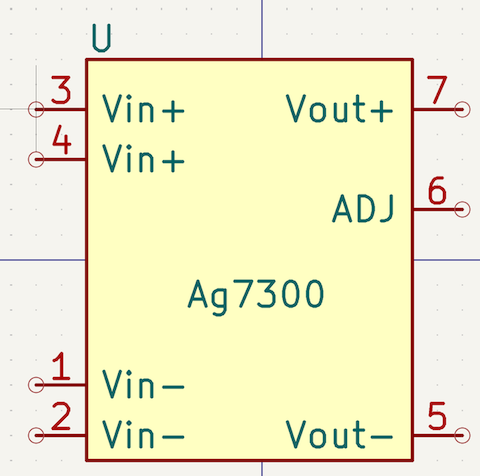
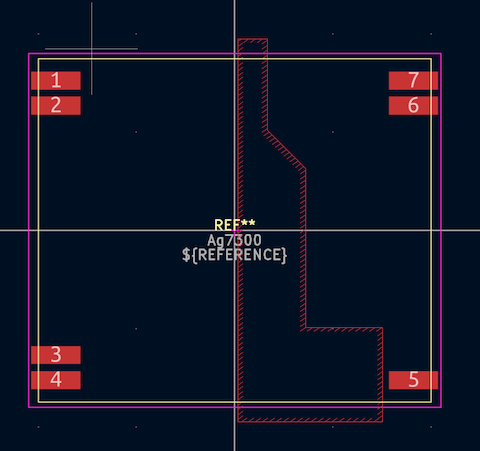
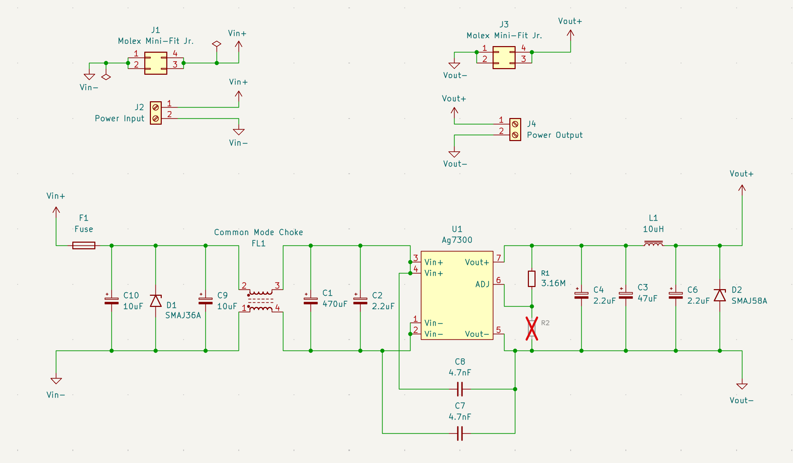

# AG7300 KiCad Files

This repository contains a KiCad symbol and footprint for the [SilverTel Ag7300](https://silvertel.com/ag7300/) DC-DC converter module.

## Usage

To use the AG7300 symbol and footprint in your own KiCad project:

1. Clone this repository or download the symbol and footprint files.
2. Add the `.kicad_sym` and `.kicad_mod` files to your project's library paths:
   - Go to **Preferences > Manage Symbol Libraries** to add the symbol.
   - Go to **Preferences > Manage Footprint Libraries** to add the footprint.
3. You can now place the AG7300 module in your schematic and PCB layout as needed.

## Schematic and PCB

Also included is a schematic similar to the official Ag7300 evaluation board.

I was planning on making a board to install in a [Ubiquiti USW-24-POE](https://techspecs.ui.com/unifi/switching/usw-24-poe) network switch, which would allow it to operate from a 24V battery:

However, I decided not to proceed further with this design as it was too similar to the evaluation board.

## KiCad Version

Tested with **KiCad 9.0.1**

## License

This project is licensed under the [MIT License](LICENSE).
